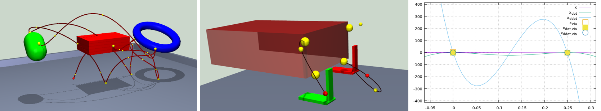

# Tropic

<p float="left">
 
</p>

Tropic stands for "TRajectory Online Planning in InteraCtion". We selected the
name "tropic", because it's a library with a number of hot features:

  - Implementations of minimum-jerk trajectory profile with arbitrary number
    of constraints, to be flexibly applied to position, velocity or
    acceleration levels, or any combination of these
  - Flexible way of incorporating new kinds of trajectory profiles
  - ConstraintSet class implementing a hierarchically organized collection of
    constraints spanning several trajectories, similar to the concept of
    motion primitives
  - Implementation of trajectories in several orientation representations
    without any representational issues such as jumps at representation
    boundaries
  - Receding horizon implementation to step and re-plan trajectories at every
    time step
  - Class to couple trajectory generation to task-level control to easily run
    with inverse kinematics / inverse dynamics
  - XML factory to read and write trajectories from and to file
  - Classes to display trajectories in OpenScenegraph and for plotting

Tropic is written entirely in C++ and requires the standard C++11. It has
been successfully compiled and ran on several Linux and Windows systems
(Ubuntu 14, 16, 18, 20, Visual studio 2015, 2017). It depends on the Rcs
library, a BSD 3-clause licensed library that can freely be downloaded from
GitHub: https://github.com/HRI-EU/Rcs. It has been hardened in several
research projects, such as for instance this one: https://www.honda-ri.de/human-robot-cooperative-object-manipulation-with-contact-changes

## Getting Started

Tropic can be compiled with the cmake build system. To compile it, just type:

    cd <build-directory>
    cmake <source-directory>
    make 

To build the doxygen documentation, just type:

    make TrajectoryDoc

## Examples

The library comes with several examples. The file **TestSimpleTrajectory.cpp**
contains examples for plotting of single trajectories and stepping them over
time. The file  **TestTrajectory.cpp** contains examples for high-dimensional
trajectories, and how to step and modify them interactively at run-time. The
examples can be started with the command-line option "-h", which will display
a help message on all available command line options and graphics window
key interactions.

## XML trajectory constraint descriptions

### Standard trajectory position constraint

This constraint allows to set per-element positions for individual trajectories.

```
  <ConstraintSet type="ConstraintSet" >
    <Constraint t="1" pos="1" vel="0" acc="0" flag="1" trajectory="MyTrajectory 0"  />
    <Constraint t="2" pos="0" vel="0" acc="0" flag="7" trajectory="MyTrajectory 1"  />
  </ConstraintSet>
```

In the above example, the position pos=1 is set to be reached at time t=1 seconds for
the first component (index 0) of the trajectory with the name MyTrajectory (first line).
The second line sets a constraint so that the position 2 is reached at time t=2 seconds
for the second component (index 1) of the same trajectory.
The flag property defines which of the position, velocity and accelerations are set.
This is what the flags mean:

 - 0 nothing
 - 1 pos
 - 2 vel
 - 3 pos + vel
 - 4 acc
 - 5 pos + acc
 - 6 vel + acc
 - 7 pos + vel + acc

### Activation constraints

These constraints can activate and deactivate individual tasks that correspond to
trajectories.

```
   <ConstraintSet type="ActivationSet" >
      <Activation t="1" switchesOn="true"  horizon="1"   trajectory="MyTrajectory" />
      <Activation t="2" switchesOn="false" horizon="1"   trajectory="MyTrajectory" />
      <Activation t="3" switchesOn="true"  horizon="0.5" trajectory="MyOtherTrajectory" />
    </ConstraintSet>
```

In the above example, the the task corresponding to MyTrajectory is switched on at
time t=1 seconds, and switched off at time t=2 seconds. The task corresponding to
MyOtherTrajectory is switched on at time t=3 seconds. It will remain on. At the time
of changing the activation state, the null space of the motion should be zero, otherwise
there might be velocity jumps. The horizon value corresponds to the time horizon during
which the null space of the motion is gradually decreased, and then increased. For
example the null space motion according to MyOtherTrajectory will start getting decreased
from t=2.5 util it is zero at t=3, and then increased to its original magnitude at t=3.5.

### Position constraints

Constraints for 3d positions. In the below example, the 3d position [0 1 2] is reached at
time t=5 seconds. The velocity and acceleration are enforced to be zero if the corresponsing
flag ist set.

```
    <ConstraintSet type="PositionConstraint" t="5" pos="0 1 2" flag="7" trajectory="MyTrajectory" />
```

### Polar angles constraints

Constraints for 2d Polar angles. This constraint has a special implementation for interpolating
Polar angles. Polar angles have representational issues such as jumps at their poles that
requires a special handling of the interpolation. In the below example, the Polar angles[0 0]
are reached at time t=2 seconds. The velocity and acceleration are enforced to be zero if the
corresponsing flag ist set. In the XML description, the angular units are expected to be degrees.

```
    <ConstraintSet type="PolarConstraint" t="2" pos="90 0" trajectory="MyTrajectory" />
```

### Euler angles constraints

Constraints for 3d Euler angles in x-y-z sequential representation. This constraint has a special
implementation for interpolating 3d orientations based on a Quaternion LERP. Native Euler angles
have representational issues such as jumps at their representation boundaries which
requires a special handling of the interpolation. In the below example, the Polar angles[90 0 60]
are reached at time t=2 seconds. The velocity and acceleration are enforced to be zero if the
corresponsing flag ist set. In the XML description, the angular units are expected to be degrees.

```
    <ConstraintSet type="EulerConstraint" t="2" pos="90 0 60" trajectory="MyTrajectory" />
```

### Pose constraints

This constraint combines a 3d-position constraint with a Euler angles constraint so that conveniently
6d poses can be specified. In the XML description, the angular units are expected to be degrees.

```
    <ConstraintSet type="PoseConstraint" t="2" pos="0 1 2 30 40 50" trajectory="MyTrajectory" />
```

### Connecting bodies constraints

This constraint is not really related to trajectory generation, but allows to change the kinematic
structure of the underlying graph.

```
    <ConstraintSet type="ConnectBodyConstraint" t="2" parent="Hand" child="Object" />
```

In the above example, the body with name "Object" will be made the kinematic child of the
body "Hand" at time t=2. Both parent and child must be valid names of bodies within the
underlying graph.

## License

This project is licensed under the BSD 3-clause license - see the [LICENSE.md](LICENSE.md) file for details

## To do

  - Rename to better wording:
  - fromXML() and toXML() should return false instead of exiting fatally
  - relPos / relRot in PositionConstraint / EulerConstraint
  - How to deal with transform pointers as anchors? Body names?
  - Fix activation access in testIK() of TestTrajectory.cpp
